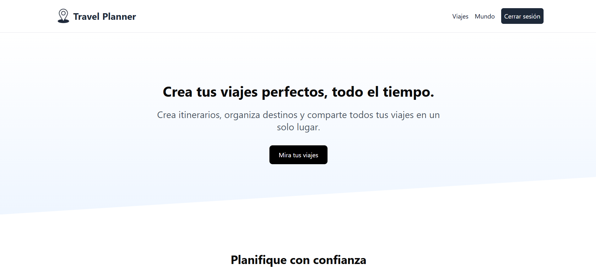
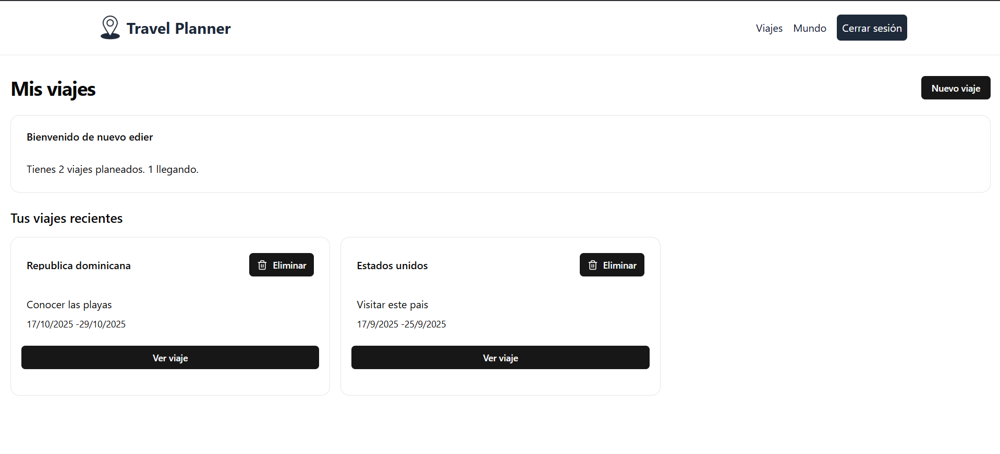

# Travel Planner

A platform for create, planification and organizate trips, using Next JS, Postgrest with Neon, uploading images and Next Auth for authenticated.

## 📸 Preview




## Getting Started

First, clone this repository:

```npm run dev
git clone git@github.com:Lainercaceres11/travel-app.git
```

Second, navigate folder:

```cd travel-planner
cd travel-planner
```

Third, run the development server:

```npm run dev
# or
yarn dev
# or
pnpm dev
# or
bun dev
```

Open http://localhost:3000 with your browser to see the result.

You can start editing the page by modifying app/page.js. The page auto-updates as you edit the file.

## 🔑 Environment Variables

To run this project, you will need to add the following environment variables to your .env file

```env
AUTH_GITHUB_ID=your_github_id
AUTH_GITHUB_SECRET=your_github_secret
AUTH_SECRET=yor_aut_secret
UPLOADTHING_TOKEN=uploading_token
GEO_API_KEY=your_api_key_geo
DATABASE_URL=url_db

## 👨‍💻 Author

https://github.com/Lainercaceres11


```
